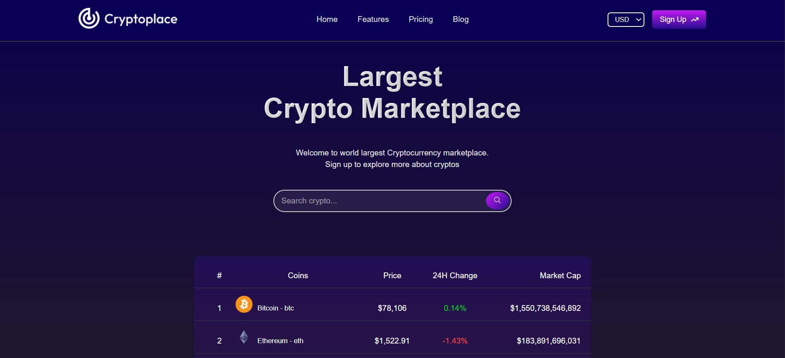
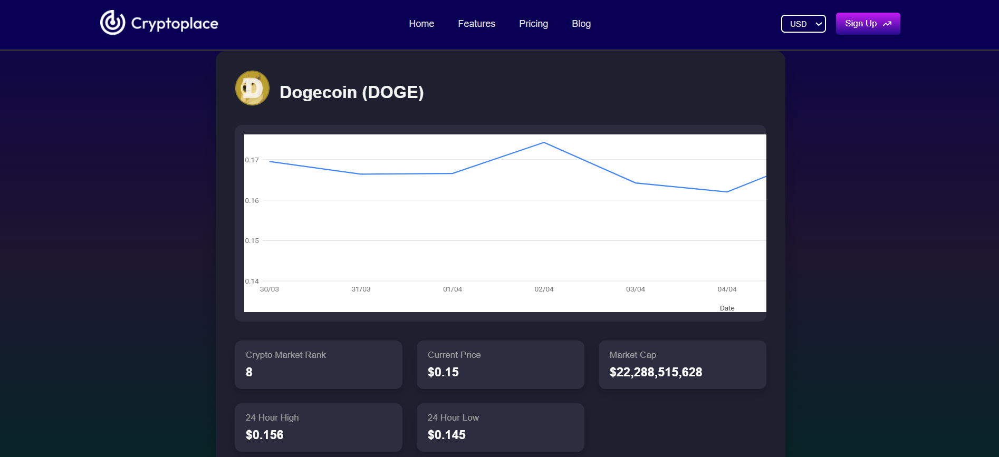

# 💹 Crypto Info Web App (React)

A sleek and modern **cryptocurrency web application** built with **React**, featuring real-time crypto market data, dynamic routing, responsive design, and elegant animations. Perfect for learning frontend development, API integration, and clean UI architecture.

---

## 🔗 Live Site

🌐 [View Live Website](https://cryptoplacepricecom.netlify.app/)

---

## 📸 Screenshots


  


---

## 🌟 Features

- 🪙 Real-time data on top cryptocurrencies
- 🔍 Coin-specific dynamic routes using React Router
- 📊 Market rank, price, and other live metrics
- ⚡ Fast and responsive on all devices
- 🎨 Clean UI with smooth CSS animations
- 🔐 Sign-up component via nested routing (optional feature)

---

## 🚀 Tech Stack

- **React** (with hooks and components)
- **React Router DOM** (v6+)
- **HTML5 & CSS3**
- **JavaScript (ES6+)**
- **Crypto API** (e.g. CoinGecko)

---

📫 Contact
If you have any feedback or suggestions, feel free to reach out!

📧 Email:surajitmandal@gmail.com

💼 LinkedInn: https://www.linkedin.com/in/surajit-mandal-b7148a306/

## 🛠️ Project Setup

```bash
git clone https://github.com/Surajitmanldal/Car-Rental.git
cd Car-Rental
npm install
npm start


